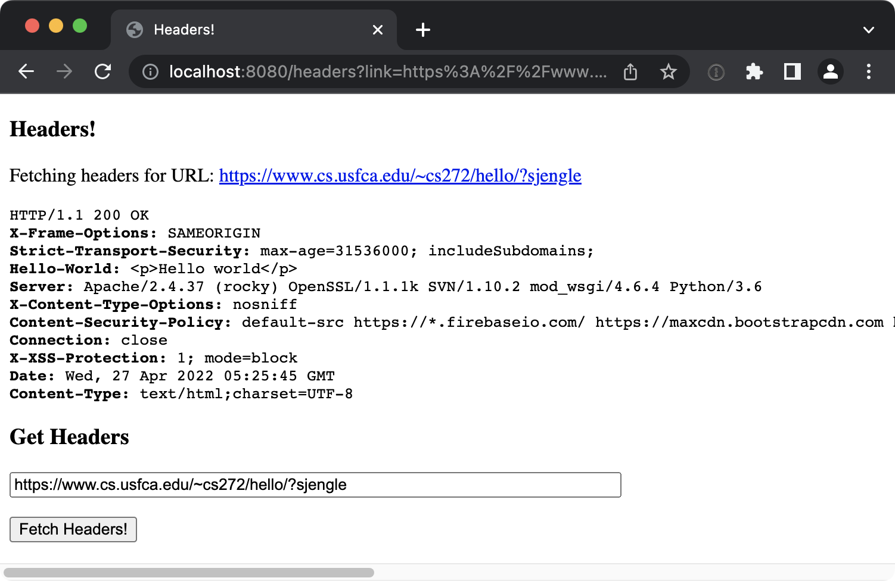
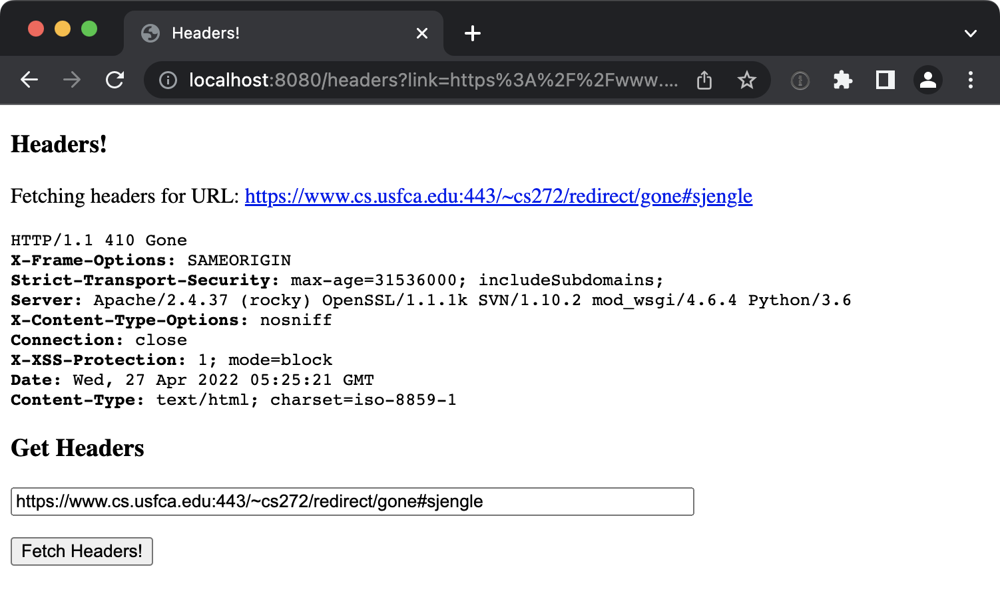
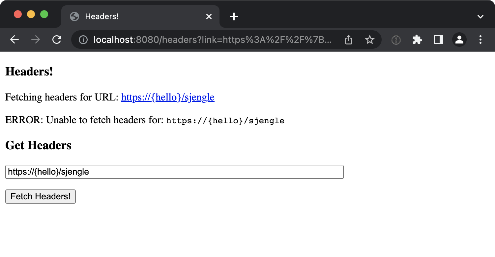
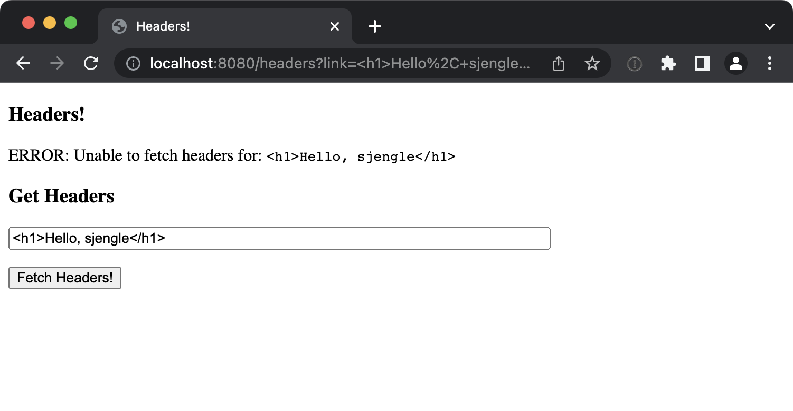

HeaderServer (Optional)
=================================================

For this homework, you will create a simple Jetty web server that allows users enter a URL and view the HTTP headers for that URL.

**This is an optional makeup homework assignment.** It may be used to make up for up to 100 points missed on earlier homework assignments, however, it is not possible to earn over 100% in the homework category.

## Functionality

Specifically, you must do the following for this assignment:

  1. **`HeaderServer.main():`** Start a Jetty web server on port 8080 and map `/headers` to the `HeaderServlet` servlet.

  1. **`HeaderServer.getHttpHeaders(URL):`** Use the `HttpsFetcher` methods to send a `HEAD` request for the provided URL and return the HTTP headers (no content). **Do NOT send a GET request to the web server!**

  1. **`HeaderServer.HeaderServlet.doGet()`** This servlet should:
  
       - Display a simple web form configured to use the `GET` HTTP method that allows users to enter a link and press a button to display the HTTP headers for that link. 
      - If the appropriate link parameter is present, the servlet should fetch and **safely** display the HTTP headers for the provided link. 
      - If the servlet is unable to fetch the headers for any reason, display a warning message on the web page. **Do NOT override the `doPost` method for this assignment!**

The servlet should reasonably protect against malicious content contained within those headers or in the link entered by the user.

## Grading 

You may use this assignment to earn back points lost due on previous homework assignments, up to a maximum of 100 points. 

:information_source: *For example, if you missed 10 points on homework 1 and 15 points on homework 2, you may request 25 points total. Alternatively, if you missed a total of 120 points on past homework assignments combined, you may only request up to the maximum of 100 points for this extra credit assignment.*

To request a grade, use the issue template provided in your GitHub repository. Since this assignment is graded *manually* (not using GitHub Actions), you will need to provide screenshots for the following test cases:

  1. `https://www.cs.usfca.edu/~cs272/hello/?[USF_USERNAME]`
  2. `https://www.cs.usfca.edu:443/~cs272/redirect/gone#[USF_USERNAME]`
  3. `https://{hello}/[USF_USERNAME]`
  4. `<h1>Hello, [USF_USERNAME]</h1>`

Replace the `[USF_USERNAME]` placeholder (including the `[` and `]` symbols) with your actual USF username before requesting the headers and taking the screenshot. See below for examples of what the responses might look like for each of these test cases.

## Examples

